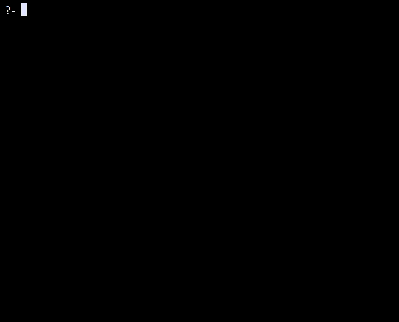

# Prolog e Árvores Genealógicas

## Parte Teórica: Os Pilares do Prolog

Para entender os exemplos, primeiro precisei entender os três elementos principais da linguagem: Fatos, Regras e Consultas.

### 1. Fatos
Os fatos são as verdades absolutas e diretas do nosso universo. São a base de tudo. No caso de Rick & Morty, um fato é simplesmente dizer quem é quem.

```prolog
% Exemplo de fato de gênero:
homem(rick).

% Exemplo de fato de parentesco:
progenitor(rick, beth).
```

### 2. Regras
As regras são onde a inteligência do sistema aparece. Elas nos permitem deduzir novas informações a partir dos fatos. Por exemplo, eu não precisei dizer ao Prolog quem eram os avôs, apenas ensinei a ele o que "ser um avô" significa:

> "Uma pessoa (X) é avô de outra (Y) **se** X for o pai de alguém (Z) **e** Z for progenitor de Y."

Em código Prolog, essa lógica fica surpreendentemente limpa:

```prolog
avô(X, Y) :- pai(X, Z), progenitor(Z, Y).
```

### 3. Consultas
As consultas são as perguntas que fazemos. Depois de descrever a família, eu pude finalmente perguntar: "Ei, Prolog, quem são os netos do Rick?".

```prolog
% Pergunta: Rick é avô do Morty?
?- avô(rick, morty).
% Resposta: true.

% Pergunta: Quem são os avôs do Morty?
?- avô(X, morty).
% Resposta: X = rick ; X = leonard.
```

---

## Parte Prática: Executando os Exemplos

### A Família de Rick & Morty

Para o segundo exemplo, escolhi a famosa família Simpson por ter uma estrutura genealógica bem conhecida. Adicionei regras para "avô" e "tia".

**Código Fonte em (`rick_morty.pl`):**
```prolog
% mulheres
mulher(summer).
mulher(beth).
mulher(diane).
mulher(joyce).

% homens
homem(morty).
homem(jerry).
homem(rick).
homem(leonard).

% fatos de parentesco de primeiro grau: projenitor(pai/mae, filho)
projenitor(rick, beth).
projenitor(diane, beth).

projenitor(leonard, jerry).
projenitor(joyce, jerry).

projenitor(jerry, summer).
projenitor(beth, summer).

projenitor(jerry, morty).
projenitor(beth, morty).

% REGRAS
% regra para definir pai, X é pai de Y?
pai(X, Y) :- homem(X) , projenitor(X, Y).

% regra para definir mãe, X é mãe de Y?
mae(X, Y) :- mulher(X) , projenitor(X, Y).

% regra para definir avô, X é avô de Y?
avô(X, Y) :- pai(X, Z) , projenitor(Z, Y).

% regra para definir avó, X é avó de Y?
avó(X, Y) :- mae(X, Z) , projenitor(Z, Y).

% regra para definir irmã(o), X é irmã(o) de Y?
% irmao(X, Y) :- (projenitor(Z, X), projenitor(Z, Y)) , X \= Y.

% Regra auxiliar: Define a filiação completa de uma pessoa.
filho_de(Filho, Pai, Mae) :- pai(Pai, Filho), mae(Mae, Filho).

% Regra de irmãos redefinida:
% X e Y são irmãos SE eles têm o mesmo pai E a mesma mãe, e X é diferente de Y.
irmao(X, Y) :- filho_de(X, P, M), filho_de(Y, P, M), X \= Y.
```

**Execução das Consultas:**

Consultas básicas.
* `?- homem(rick).` (rick é homem?)
* `?- mulher(joyce).` (joyce é mulher?)
* `?- progenitor(diane, summer).` (diane é progenitor de summer?)



Neste caso, foquei em consultas que usavam as regras mais complexas.

* `?- avô(rick, morty).` (rick é avô de morty?)
* `?- irmao(morty, summer).` (morty é irmão de summer?)
* `?- pai(jerry, X).` (Quem são os filhos do jerry?)


---

## Dificuldades e Aprendizados

Durante o desenvolvimento deste trabalho, encontrei alguns desafios que foram importantes para o meu aprendizado:

1.  **A Sintaxe do Ponto Final:** No começo, esqueci várias vezes de colocar o `.` no final das cláusulas, o que impedia o programa de carregar. Aprendi que, em Prolog, a sintaxe é muito rigorosa.
2.  **A Lógica da Regra `irmão`:** Minha primeira tentativa de criar a regra para "irmão" resultou em o programa me dizendo que uma pessoa era irmã de si mesma. Tive que ir atrás de entender o operador `\=` para diferenciar os sujeitos. Foi um ótimo exemplo de como a lógica precisa ser explícita.
3.  **Maiúsculas vs. Minúsculas:** Confundi variáveis (maiúsculas) com átomos (minúsculas), o que gerou resultados inesperados. Isso me forçou a entender um dos conceitos fundamentais da linguagem.

## Conclusão

Este trabalho foi uma introdução fascinante ao mundo da programação em lógica. Achei incrível como, ao invés de dar comandos, eu simplesmente descrevi o mundo (a família) e o Prolog foi capaz de deduzir relações complexas. É uma forma de pensar sobre problemas muito diferente e poderosa.

## Referências Bibliográficas

Para a realização desta atividade, foram consultadas as seguintes fontes que me ajudaram a compreender a sintaxe, a semântica e a filosofia da programação em lógica com Prolog.
1.  https://www.swi-prolog.org/
2.  Material didático da disciplina
3.  https://youtube.com/playlist?list=PLZ-Bk6jzsb-OScKa7vhpcQXoU2uxYGaFx&si=3gyeeZiRBruIubsr

